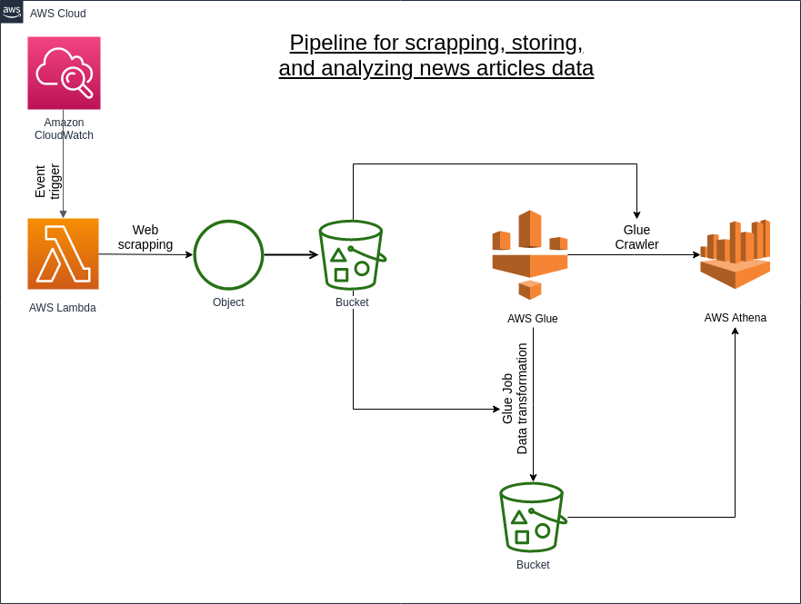

# News content/metadata scrapping and analytical pipeline

The project aims at gathering news articles' metadata such as date of publishing, view count, comment count, tags, etc.
The content information is represented by title, subtitle and article's text.

The collected data is further used for analytics of current online media news trends and a mild degree of Natural Language Processing.

The collection and initial processing of the data has been handled through the pipeline described below.

